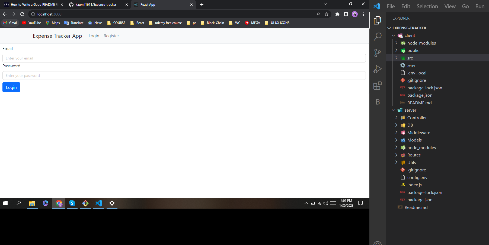
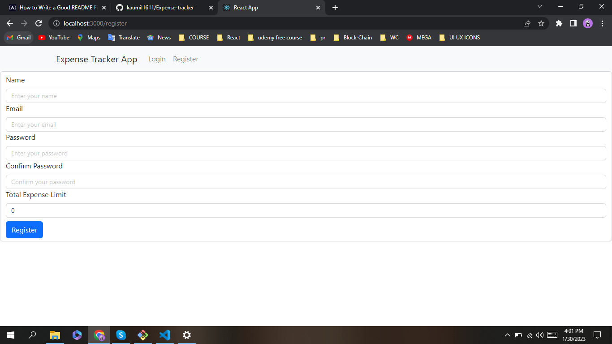

# **Expense Tracker Web Application**

### _This web application usually track every individual expense of particular categories and show their expense limit_

---

# **Project Description**

- _I used React Library with Redux for frontend and Node js, Express js and MongoDB used for backend._

* _This project mainly handle CRUD Operation._

* _User can login and register in this web app. at a same time of register user enter their total expense limit. This total expense limit is necessary for tracking their daily activity such as user add their expense on particular category. If sum of their expense limit exceed total expense limit then error message pop-up. Similarly, Category have also category limit. So, that user also expense their expenses in particular category with its limit. If limit of expenses increase then error message pop-up._

* _User edit their expense and category and also perform delete operation to delete particular category during time of edit user enter high amount then their limit same error-message pop-up. In short, app have full validation in both client and server side._

* _User perform sorting and searching facility._

# \*\* How to install and Run the Project

## Prerequisites

- Node.js (version 12 or higher)
- npm (version 6 or higher)

## Installation

1. Clone this repository to your local machine

### _https://github.com/kaumil1611/Expense-tracker.git_

2. Navigate to the `client` directory

### $cd Expense-Tracker/client

3. Install the dependencies

### _$ npm install_

4. Repeat the steps 2 and 3 for the `server` directory

5. Create a `.env` file in the `server` directory with the following contents:

### _PORT=<port number>_

## Running the Project

1. Start the React app

### _$ cd Expense-Tracker/client_

### _$ npm start_

The application should now be accessible at http://localhost:<port number>

# **Out-Put**

